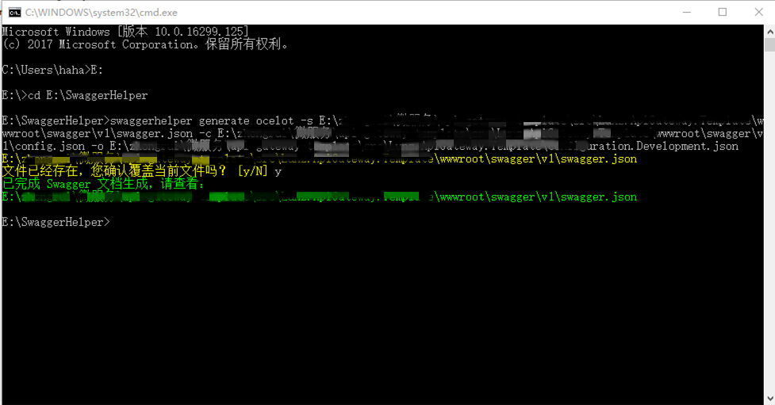

# SwaggerHelper

`SwaggerHelper` 工具是在使用 [Ocelot](https://github.com/ThreeMammals/Ocelot) 时，为了将多个微服务的 Swagger.json 文件进行合并，以方便在 API 网关中使用 [Swagger](https://swagger.io/) 工具。

## 命令介绍    

- `swaggerhelper generate ocelot -s|--savePath <param1>  -c|--configPath <param2>  -o|--ocelotPath <param3>`      
`param1`：Swagger 文档文件保存的路径，必须。     
`param2`：用于生成 Ocelot Swagger 文档的配置文件所在的路径，必须。    
`param3`：ApiGateway 配置文件所在的路径，必须。

示例：
   
 `swaggerhelper generate ocelot -s E:\ocelot-sample1\wwwroot\swagger\v1\swagger.json -c E:\ocelot-sample1\wwwroot\swagger\v1\config.json -o E:\ocelot-sample1\configuration.Staging.json`

## 使用注意事项

### 1. 自定义 SwaggerConfig.json 文件的配置
示例：

    {
      //与 configuration.json 中的下游微服务地址匹配。
      "downstreamSwaggers": [
        {
          "host": "10.144.60.246",
          "swaggerUrl": "http://localhost:59801/swagger/V1/swagger.json"
        },
        {
          "host": "115.28.33.225",
          "swaggerUrl": "http://localhost:59803/swagger/V1/swagger.json"
        }
      ],

      //给最后组合成的总的 Swagger.json 文件设置统一的 info 信息，属性可以增删。
      "info": {
        "title": "API Gateway for Microservice Template",
        "version": "1.0.0"
      }
    }

Ocelot 配置文件中，每注册一个微服务，就需要在 SwaggerConfig.json 中增加一条注册信息，例如：

	{
      "host": "10.144.60.246",
      "swaggerUrl": "http://localhost:59801/swagger/V1/swagger.json"
    }

SwaggerHelper 工具通过读取 Ocelot 配置文件和 SwaggerConfig.json 文件来完成组合和生成新的 swagger.json 文件。

为了配合 SwaggerHelper 工具的使用，ApiGateway 项目中需要创建 swagger 的 config.json 文件。

**注意**：其中配置信息中 host 的值不仅要与 Ocelot 配置文件中的下游微服务地址相同，而且不同微服务之间不能重复。

### 2. 使用示例

